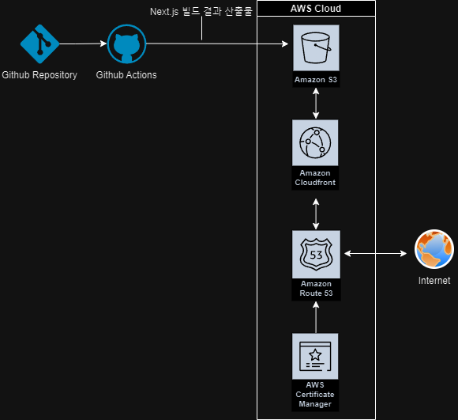

# 프론트엔드 배포 파이프라인

## 목차

1. [배포 프로세스](#배포-프로세스)
2. [주요링크](#주요-링크)
3. [주요개념](#주요-개념)
4. [기대효과](#기대-효과)

## 배포 프로세스

1. 저장소를 체크아웃
2. Node.js 18.x 버전을 설정
3. 프로젝트 의존성을 설치
4. Next.js 프로젝트를 빌드
5. AWS 자격 증명을 구성
6. 빌드된 파일을 S3 버킷에 동기화
7. CloudFront 캐시를 무효화

## 주요 링크

- S3 버킷 웹사이트 엔드포인트: http://azamwa.s3-website.ap-northeast-2.amazonaws.com/
- CloudFrount 배포 도메인 이름: https://d1p7afoijv58y.cloudfront.net
- 배포된 사이트: https://hhplusfront3rd.shop/

## 주요 개념

- GitHub Actions과 CI/CD 도구

  - GitHub Actions: 소프트웨어 개발 워크플로우를 자동화하는 도구입니다. CI/CD 파이프라인을 구성 가능
  - CI(Continuous Integration, 지속적 통합): 개발자가 코드를 통합하여 변경 사항을 자동으로 빌드하고 테스트하는 프로세스
  - CD(Continuous Delivery/Deployment, 지속적 배포): CI 이후의 단계로, 애플리케이션을 프로덕션 환경이나 실제 사용자 환경에 자동으로 배포하는 프로세스

- S3와 스토리지

  - 스토리지: 데이터를 저장하고 관리하는 기술이나 시스템. 우리는 주로 객체 스토리지를 다룬다.
  - Amazon S3: Amazon Web Services(AWS)에서 제공하는 객체 스토리지 서비스로, 데이터 저장 및 관리의 효율성을 제공
    - 객체 기반 스토리지: S3는 데이터를 객체 단위로 저장. 각 객체는 데이터, 메타데이터, 고유 식별자로 구성
    - 확장성: S3는 거의 무한에 가까운 저장 용량을 제공하며, 필요에 따라 자동으로 확장
    - 보안: S3는 AWS IAM 정책, 버킷 정책, ACL을 통해 데이터 접근을 세밀하게 제어 가능
    - 정적 웹사이트 호스팅: S3는 정적 웹사이트 파일(HTML, CSS, JavaScript 등)을 호스팅 가능

- CloudFront와 CDN

  - CDN: 전 세계 여러 서버에 데이터를 분산 저장하여, 사용자와 가장 가까운 서버에서 콘텐츠를 제공하는 기술
    - 웹사이트 성능 향상: 사용자에게 더 빠르고 효율적으로 웹페이지를 제공
    - 미디어 콘텐츠 전송: 동영상, 음악 파일, 이미지 등의 미디어 콘텐츠를 빠르게 전송
    - 트래픽 분산: 대규모 트래픽을 여러 서버에 분산시켜 서버의 과부하를 방지
  - CloudFront: AWS에서 제공하는 CDN 서비스
    - API 응답 최적화: API 서버의 응답을 캐싱하여 서버 부하를 줄이고 응답 속도를 향상
    - S3, EC2 등 다양한 AWS 서비스와 통합하여 콘텐츠를 빠르고 안전하게 제공

- 캐시 무효화(Cache Invalidation): 이미 캐시된 데이터를 더 이상 유효하지 않게 만들어, 새로운 데이터로 교체하는 과정

  - 캐시무효화의 주요방법
    - TTL(Time-To-Live) 설정: 캐시된 데이터에 만료 시간을 설정하여, 일정 시간이 지나면 자동으로 캐시가 만료
    - 수동 캐시 무효화: CloudFront에서는 특정 파일이나 경로에 대해 캐시를 수동으로 무효화할 수 있는 기능을 제공
    - 버전관리: 캐시된 콘텐츠에 버전 번호나 해시 값을 추가하여 파일 이름을 변경함으로써 새로운 콘텐츠로 캐시 교체 가능
    - Edge 캐시 제어: CloudFront는 엣지 로케이션(특정 파일)에서 캐시를 제어할 수 있는 옵션을 제공.

- Repository secret과 환경변수
  - Repository Secret: GitHub 리포지토리에서 사용하는 보안 정보를 저장하는 방법. CI/CD 파이프라인에서 비밀 정보를 안전하게 사용하기 위해 secrets로 설정한 값들을 워크플로우 파일 내에서 ${{ secrets.SECRET_NAME }} 형태로 참조
  - 환경변수: 운영 체제나 애플리케이션에서 설정 값을 저장하고, 이를 프로그램이나 스크립트에서 접근할 수 있도록 하는 변수

## 기대 효과

- 자동화된 배포 과정
  - 수동배포의 제거: 배포 실수 감소, 시간 절약 가능.
  - 일정한 배포 프로세스 유지: 일관성 보장. 배포오류 최소화
- 실시간 빌드 및 테스트: 배포 전에 빌드와 테스트를 자동으로 진행할 수 있어, 배포 전에 코드에 문제가 있는지 바로 확인 가능
- 배포의 트래킹: 배포된 코드, 변경 사항, 배포 시간 등을 확인할 수 있어, 문제 발생 시 원인 추적이 용이
- 협업의 향상: 팀원들은 GitHub을 통해 코드 리뷰, 피드백, 배포 상태를 실시간으로 확인가능
